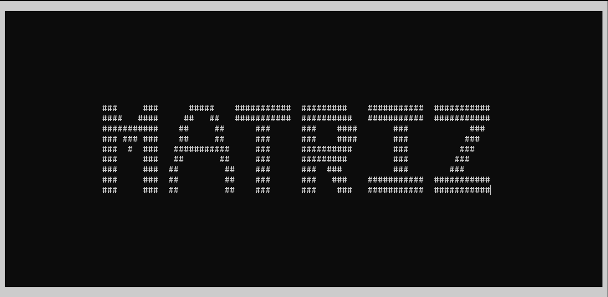

<h1 align="center">
   Calculadora de Matriz
</h1>

 

  

# Sobre

O código feito foi utilizado como trabalho final da disciplina de Programação Computacional na Universidade Federal do Ceará(UFC), 2023

Participantes:
- Pablo Henrique da Silva Andrade
- Messias Trajano Barbosa
- Gildésio Araújo Félix

# Instruções de uso:
Ao execultar o código aparecer o nome MATRIZ, após 3 segundos aparecerar o menu de opções, use ↑, ↓ e ⏎ para controlar 
Após selecionar a opção desejada código irá pedir que digite as dimensões da matriz e após o povoamento. Depois deste processo inicial será amostrado o resultado e depois opções de voltar para o menu de opções.
OBS: 
    1. Apenas será permitida matrizes quadradas em casos das opções: Soma, Substração, Determinante e Inversa
    2. Em caso de uso de letras ao colocar as dimensões ou no preenchimento das matrizes resultarar em mensagem ERRO
    3. 

## Opções de Calculo de Matriz:

- Soma de Matrizes
- Multiplicação da Matriz por um Numero
- Subtração de Matrizes
- Transposição de Matrizes
- Multiplicação de Matrizes
- Determinante da Matriz
- Matriz Inversa

